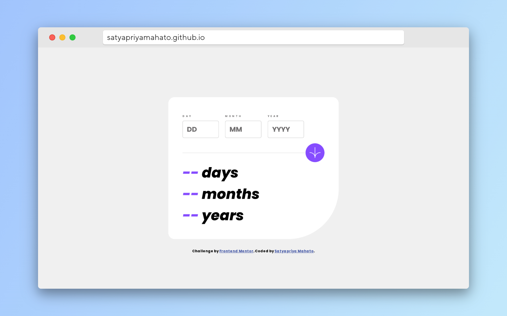

# Frontend Mentor - Age calculator app solution

This is a solution to the [Age calculator app challenge on Frontend Mentor](https://www.frontendmentor.io/challenges/age-calculator-app-dF9DFFpj-Q). Frontend Mentor challenges help you improve your coding skills by building realistic projects. 

## Table of contents

- [Overview](#overview)
  - [The challenge](#the-challenge)
  - [Screenshot](#screenshot)
  - [Links](#links)
- [My process](#my-process)
  - [Built with](#built-with)
  - [What I learned](#what-i-learned)
  - [Continued development](#continued-development)
  - [Useful resources](#useful-resources)
- [Author](#author)
- [Acknowledgments](#acknowledgments)


## Overview

### The challenge

Users should be able to:

- View an age in years, months, and days after submitting a valid date through the form
- Receive validation errors if:
  - Any field is empty when the form is submitted
  - The day number is not between 1-31
  - The month number is not between 1-12
  - The year is in the future
  - The date is invalid e.g. 31/04/1991 (there are 30 days in April)
- View the optimal layout for the interface depending on their device's screen size
- See hover and focus states for all interactive elements on the page
- **Bonus**: See the age numbers animate to their final number when the form is submitted

### Screenshot



### Links

- Solution URL: [solution](https://github.com/SatyapriyaMahato/age-calculator-app)
- Live Site URL: [age-calculator-app](https://satyapriyamahato.github.io/age-calculator-app/)

## My process

### Built with

- Semantic HTML5 markup
- CSS custom properties
- Flexbox
- CSS Grid
- Vanilla Javascript


### What I learned

Inthis project i learned how to read elements from user using javascript using getElementById and how function work in javascript. Also I learned about media queries by which the website responds to different screen sizes.


```css
@media screen and (max-width: 375px) {
}
```
```js
const form = document.getElementById('form');

function checkLeapYear(year) {

    const leap = new Date(year, 1, 29).getDate() === 29;
    if (leap) {
        return true;
    } else {
        return false;
    }
}
```

### Continued development

I am not very confident with the logic and implementation of calculating the age. I have used a brute force approach for this project thatswhy there may be a more efficient way to do the task.

### Useful resources

- [Flexbox](https://developer.mozilla.org/en-US/docs/Web/CSS/flex) - This helped me for making the form using flexbox
- [eventListener](https://developer.mozilla.org/en-US/d) - This taught what are event listeners and how to use them.


## Author

- Website - [Satyapriya Mahato](https://satyapriyamahato.github.io/Personal-Site/)
- Frontend Mentor - [@satyapriyamahato](https://www.frontendmentor.io/profile/satyapriyamahato)
- Twitter - [@satyapriyamahto](https://www.twitter.com/satyapriyamahto)


## Acknowledgments

